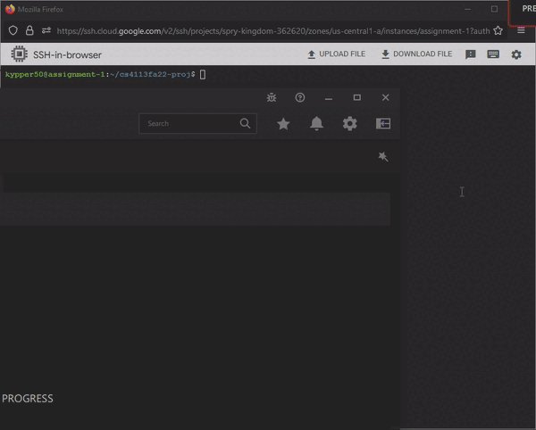

## Development Schedule
Week 1
- [x] Assign players a correct emoji
- [x] Spawn players in unique spots
  
Week 2
- [x] Implment telling players the board
- [x] Implment players moving
  - [x] Record player's paths
  
Week 3-4
- [x] Implment trainers capturing pokemon
  - [x] Give trainers a pokedex
- [x] Tell pokemon they're captured
- [x] Shutdown trainers when all mons are captured

Final tasks
- [ ] Successfully scale from 4 total players to 46.

## Emoji Chooser
Each client (either Trainer or Pokemon) will call the server's join method, sending their hostname (trainerN or pokemonN) and recieving a unique emoji back from the server. Once a player joins the game, the server assigns the player a space and updates two hashmaps: player_to_space and space_to_players. The board state is stored in the space_to_players hashmap which maps each possible spot to a list of players currently in that spot.

To configure the size of the grid, number of trainers, and number of pokemon:  
`python3 config.py <N> <T> 
`  
The script will write a docker-compose file matching the given parameters.

## Protocol Buffer
Currently, the protocol buffer in `code/pokemon.proto` defines join, get_neighbors, move, capture, and captured functions. So far only the join function which allows clients to be assigned an emoji and spawn on the board is implmented. The other functions listed are subject to change as development continues.

## Interfaces
| Functions | Purpose | In | Out | Plan to Test |  
| --- | --- | --- | --- | --- |  
| join | Allows clients to join the game and be assigned an emoji | Client name | Emoji | This is tested by clients printing out their given emoji and comparing it to the servers printed board | 
| get_neighbors | Returns the spaces around the player | Client name | A list of what each space contains | This is testable by comparing the servers response to the servers board (printing what the client gets vs board print out) |  
| move | Moves a player in their desired direction | Client name, cardinal direction | Boolean if move was successfull, boolean if client is captured or not (pokemon only) | This is testable by allows the clients to move and ensuring they shut down on capture |   
| capture |	Allows trainers to try and capture pokemon in the same spot | Client name | Emoji of pokemon if one was captured | This is testable by having the client print their captured pokemon and comparing it to the emoji of the capture pokemon container |

## Start up logging
  
First the `make grid_size=8 trainer_count=1 pokemon_count=2 config` command is run to set the game's parameters. Then the `make run` command is used to create the necessary containers and start the game.

## Printing the board
  
Each player in the game joins, is assigned a random starting location, and then the server displays the game board.
